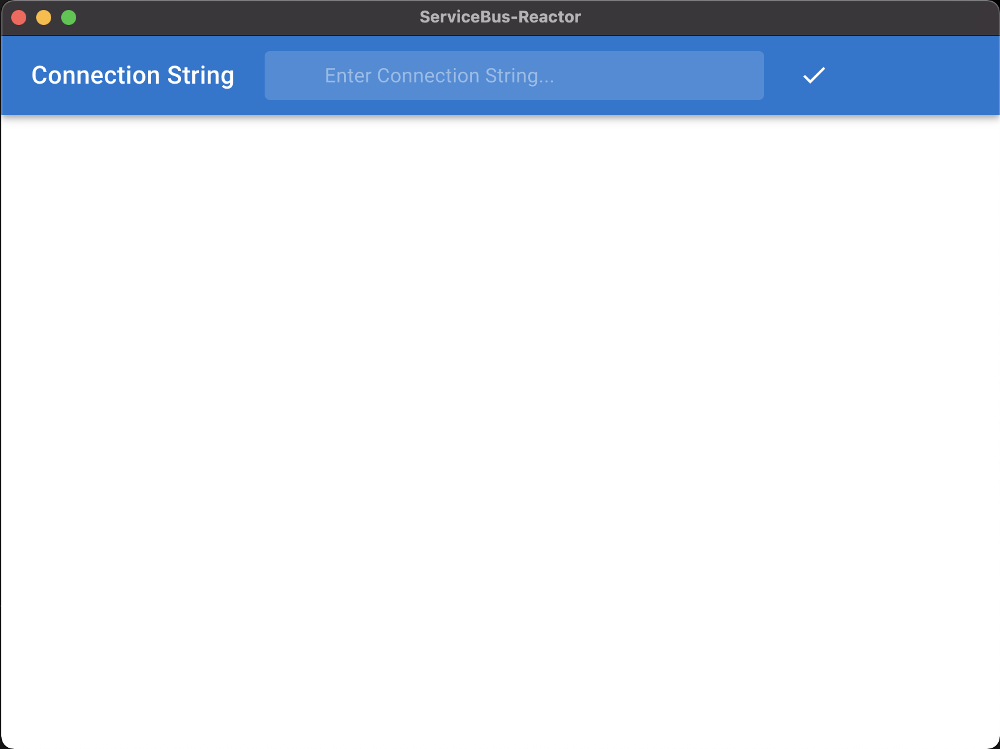
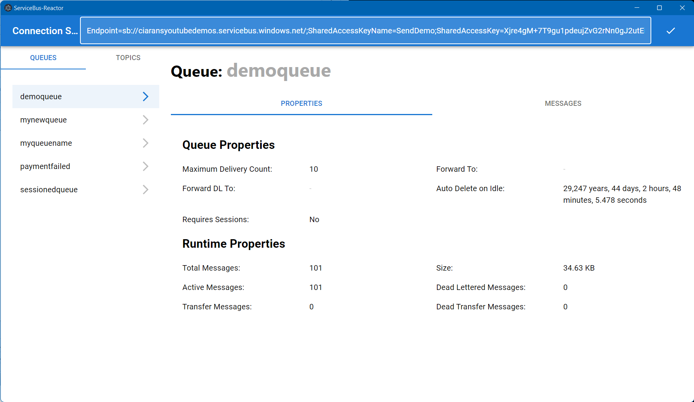

# ServiceBus-Reactor

This project is a UI for interacting with Azure Service Bus.
It is supposed to be an improvement on the Service Bus Explorer functionality included in the Azure Portal.

It's an Electron based application built with React. 
In fact the primary reason I got started with doing this was to learn React.

## Running the code

It's a standard Electron app, so you can get the code out  and call:

```
> npm install
> npm start
```

Which starts the React web server. Then in a new terminal window you run 

``` 
> npm run electron 
```
which starts the electron app, loading the website from the webserver. This means it will have hot-reload for the changes you make to the code.
## Using the App

When the app starts it will be empty except for the bar at the top. In this bar you need to paste in a Connection String for Service Bus and hit the  ✔️ button.



This will cause the app to connect to Service Bus and load the List of Queues and Topics that exist. 

Selecting a Queue or Topic will open a panel for viewing its properties. This is the section of the application currently being developed

Viewing a Queue looks like this:


Switching to the messages tab allows you to Peek the messages:


## Immediate Plans

Features looking to implement in the near term:

1. Moving all messages from Queue/Subscription to Dead Letter Queue
2. Moving all messages from Dead Letter Queue back to Queue/Subscription 
3. Purging all messages from a Queue/Subscription
4. Purging all messages from a Dead Letter Queue
5. Message Viewer to see details of a message
6. Viewing Subscription filters
7. Editing Subscription filters
8. Creating a new Queue
9. Creating a new Topic
10. Creating a new Subscription
11. Setting up forwarding
12. Sending a message
13. Message formatters to allow easy sending/receiving of MassTransit or nServiceBus messages
14. Ability to save connections
15. Ability to peek/receive Queue/Subscription/DLQ to a file
16. Ability to send to Queue/Topic from a file

